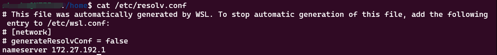
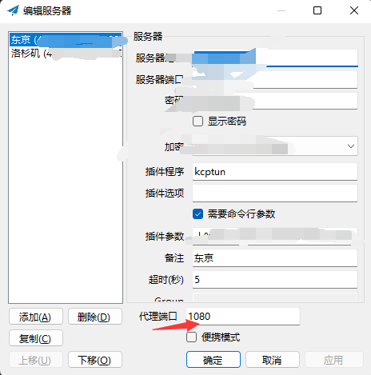
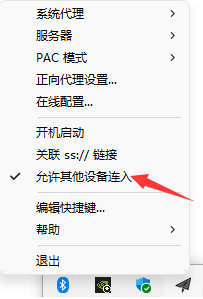
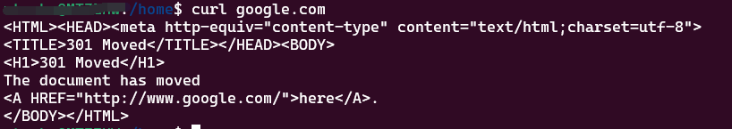

# 在 WSL2 中使用 Shadowsocks

> WSL2 的网络不再像 WSL1 一样与 Windows 共享，想在其中使用 SS 就必须把网络代理到宿主机上。

<!--truncate-->

## 获取宿主机 IP

WSL2 把宿主机 IP 存放在 `/etc/resolv.conf` 中，运行 `cat /etc/resolv.conf` 查看。



## 设置代理

有了宿主机 IP 之后，通过设置环境变量的方式设置代理。

```shell showLineNumbers
export http_proxy='http://<Windows IP>:<Port>'
export https_proxy='http://<Windows IP>:<Port>'
```

Windows IP 就是刚才获得的宿主机 IP。Port 填 SS 的代理端口，默认是 1080，具体可以在服务器编辑中查看。



## 允许其他设备连入

在 SS 设置中选择允许其他设备连入。



此时 WSL 的网络请求已被代理，运行 `curl google.com` 测试，得到如下结果，说明设置成功。



## 自动设置

上面的方法每次 WSL 重启，环境变量都要重新设置一遍，因此可以通过修改环境变量文件的方式设置。作者喜欢用在 profile.d 中编写脚本的方式来修改，这样比较好维护。

在 `/etc/profile.d` 下新建名为 shadowsocks-proxy.sh（名字随意）的脚本并输入如下内容。

```shell showLineNumbers
#!/bin/sh

hostip=$(cat /etc/resolv.conf | grep nameserver | awk '{ print $2 }')
port=1080

PROXY_HTTP="http://${hostip}:${port}"

export http_proxy="${PROXY_HTTP}"
export HTTP_PROXY="${PROXY_HTTP}"
export https_proxy="${PROXY_HTTP}"
export HTTPS_proxy="${PROXY_HTTP}"
```

这样每次启动 WSL 就不需要重新设置了。
