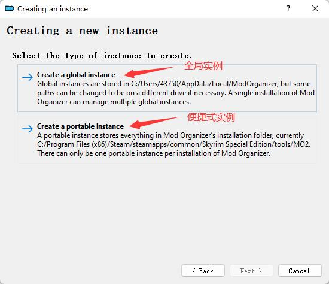
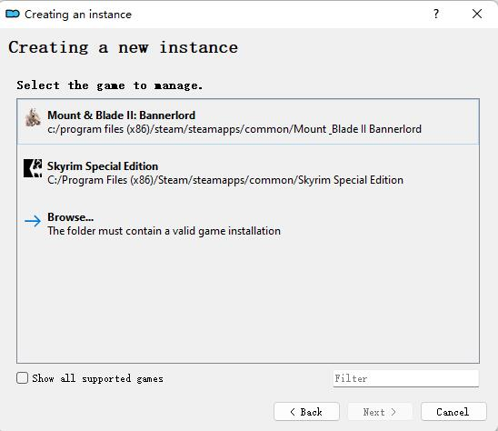
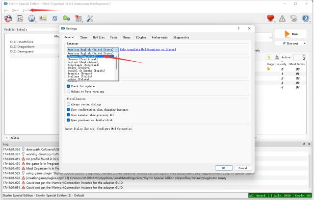

# 上古卷轴 5: 天际特别版 2022 年 Mod 安装入门

> 上古卷轴 5 发售已 10 年之久, 期间 Mod 管理工具不断演化, 很多早期的 Mod 使用教程在今天已不再适用, 本文旨在让新人小白在 2022 年用更现代化的方式使用 Mod

<!--truncate-->

首先在开始前, 我们需要先了解上古卷轴 5 现存的不同版本

| 版本            | 全称                       | 简称     | 版本号           |                          |
| :-------------- | :------------------------- | :------- | :--------------- | :----------------------- |
| 原版            | Skyrim                     | -        | -                | 原版                     |
| 传奇版          | Skyrim Legendary Edition   | LE / SLE | -                | 原版 + 全 DLC            |
| 特别版 (重制版) | Skyrim Special Edition     | SE / SSE | 1.5.97           | 传奇版的重制版           |
| VR 版           | Skyrim VR                  | VR / SVR | -                | 基于特别版开发的 VR 版本 |
| 周年纪念版      | Skyrim Anniversary Edition | AE / SAE | 1.6.353 (更新中) | 特别版 + 官方 Mod        |

本文 **以 Steam 上的 SE 版本为基础**. 之所以选择 SE 版本而不是 AE 版本, 原因在于有的 Mod 在 AE 版上存在兼容性问题. 虽然大部分为 SE 版本开发的 Mod 能完美兼容 AE 版本, 并且目前也有许多主流 Mod 推出了相应的 AE 版. 但如果遇到心仪的 Mod 不兼容, 并且此时已安装了太多 Mod (作者本人就遇到过) , 那更换版本将是一件极其痛苦的事

:::caution 注意

自 2021 年 11 月 AE 版发布后, SE 版将自动更新至 AE 版, 版本号也会从 1.5 升至 1.6 , 如果你的游戏为 AE 版本, 请使用降级工具重新安装游戏, 推荐 <a href="https://www.nexusmods.com/skyrimspecialedition/mods/61756" target="_blank">Unofficial Skyrim Downloader</a>

:::

## 前期准备

- 安装 **英文版** 游戏 (中文版并非游戏最新版, 如果已下载中文版, 可以在 Steam 库中右键游戏 -> 属性 -> 语言 -> 选择英文)

- 如果已安装过 Mod, 建议删除游戏重新安装

## 安装 Mod 管理器

目前比较主流的 MOD 管理工具有以下两个

| 工具   | 简介                                                                                     | 下载地址                                                       |
| :----- | :--------------------------------------------------------------------------------------- | :------------------------------------------------------------- |
| MO2    | 全称 Mod organizer 2 , 社区推出的 Mod 管理工具, 可以关联 Nexus 账号做到一键下载 Mod.     | [下载](https://github.com/ModOrganizer2/modorganizer/releases) |
| Vortex | Nexus 官方推出的 Mod 管理工具, 除了可以一键下载 Mod 外, 还可以一键下载 Nexus 上的整合包. | [下载](https://www.nexusmods.com/site/mods/1)                  |

:::note

好多老教程可能会推荐使用 NMM (Nexus Mod Manager), 这个工具非常老了, 官方下载渠道已经关闭, 任何时候都不建议使用

:::

本文 MOD 管理 **以 MO2 为基础**. Vortex 集成了太多非上古卷轴 Mod 管理的功能, 比如可以管理超过 65 种游戏的 Mod, 首页甚至有新闻, 对我来说功能太冗余. 并且因为国内网络环境的原因, 导致好多功能其实根本无法使用. 而在 Mod 管理方面, 二者功能差不多. 因此不推荐使用

### 下载 MO2 并安装

直接下载 exe 文件并安装即可, 安装时要注意以下几点

- 不建议安装在受系统保护的文件夹中, 例如 Programs Files (也正是 Steam 游戏默认安装的文件夹). 因为 MO2 用于管理 Mod 的核心库 (VFS) 会 hook 正在运行的应用程序并修改系统调用, 可能会因为你的计算机账户没有写入权限而使程序出错

- 避免在 Game 文件夹中安装 MO2, 因为这会导致 VFS 出现问题

- MO2 是 64 位应用程序, 因此需要 64 位操作系统才能运行

### 创建实例

#### 选择要创建的实例类型

第一次启动 MO2 会强制创建一个实例

一个实例可以简单看成包含 Mods、下载文件、配置等的沙箱. 实例之间互不影响. 可以通过切换实例来管理不同游戏甚至同一游戏的不同 Mod 组

全局实例允许创建多个实例；便携式实例会将实例创建在 MO2 的根目录下, 只能创建一个便携式实例. 如果只想管理上古卷轴的 Mod 并且只准备管理一组 Mod, 建议选择便携式实例

#### 选择要管理的游戏

选择 SSE 即可, 如果 MO2 没有识别出游戏, 可以点击 Browse 手动选择游戏根目录

#### 自定义实例名称、选择数据存储位置

不想管就一路选择 Next 即可

### (可选) 切换到中文

选择 Tools -> Settings -> Chinese Simplified

## Mod 安装与使用

待续。。。
